# ATlang
This is the repository for the **ATlang** language. The **ATlang** language is a mixture of several languages, including C and Python. It is a simple translator that accepts **ATlang** and translates it to C. Some other iteration of the language may use LLVM to generate code. This will never be an interpreted language system.

## Why?
The reasons for implementing **ATlang** are very simple. I love programming languages and I love writing code. I have always wanted to create a language from scratch and then write a bunch of code in it. I have made numerous attempts, and as of February 2021, this is the latest one.

## Goals
* **ATlang** is object oriented. Only classes are used to implement functionality.
* **ATlang** is strongly typed but also allows robust casting.
* **ATlang** has garbage collection.
* **ATlang** does not have pointers or NULL values.
* **ATlang** supports maps, dictionaries, and lists natively.
* **ATlang** has a simplified native type system that supports ints, uints, floats, bools, and strings natively.
* **ATlang** follows the notion of having as few keywords and operators as possible, while still being able to implement complex programs. It is intended to be a application language, rather than a system language that has things like bitwise operations.
* **ATlang** follows the notion of having a clear and obvious way to do something. There may be more than one semantic paths, but that stems from making a choice to put in optional elements or leave them out. It's intended to be as simple as possible, but no simpler.

## Syntax

The following is a list of diagrams that show the whole syntax of **ATlang**. The only thing that is not shown in the diagrams is the contents of terminal objects such as comments, symbols, strings, and numbers. The intention is to demonstrate the workings of the parser, not the scanner.


Top level non-terminal is a Module.

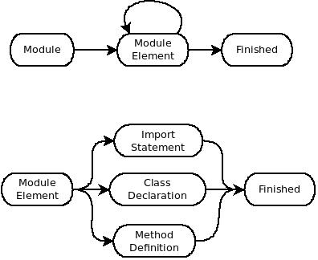

An import statement is used to bring in symbols from another module. It does not bring in that module's implementation.

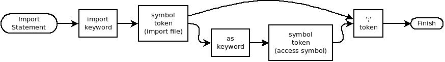

The class declaration is a simple declaration that does not include any initialization. The reason for that is that when the source code is translated into C, the classes become ```typedef struct```s.


The method and data declarations only contain the scope, the assignment type, and the types of the parameters for method declarations.

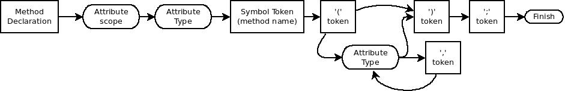

Class data declaration does not allow assignment.


The attribute scope non-terminal is only used inside a class. The type attribute gives the assignment type. These keywords have the meaning one might expect.


The complex symbol non-terminal is used everywhere a symbol reference is applicable. The complex symbol name refers more to the implementation of the resolver than the actual usage because a simple name is also acceptable there.

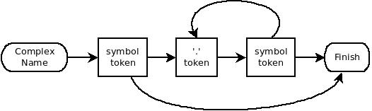

A formatted string is used everywhere that a quoted string is acceptable, included as an argument to a formatted string. Note that only double-quoted string can be formatted. Single quoted string are taken to be absolute literals.


A method definition is exactly that. These diagrams do not cover the rules for defining and implementing constructors and destructors. Note that only the type and scope are not given in the method definition because they have already been specified in the declaration. All of the following diagrams support method definitions.

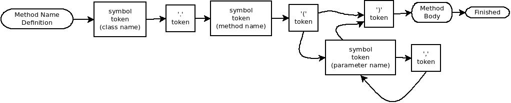


 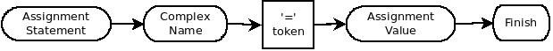

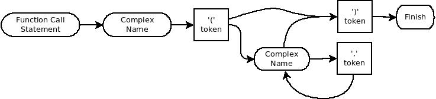


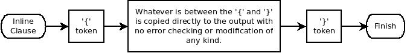

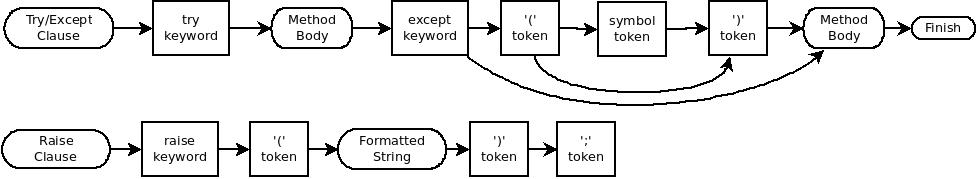

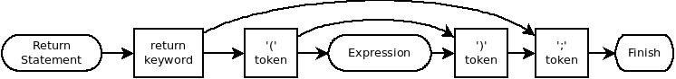

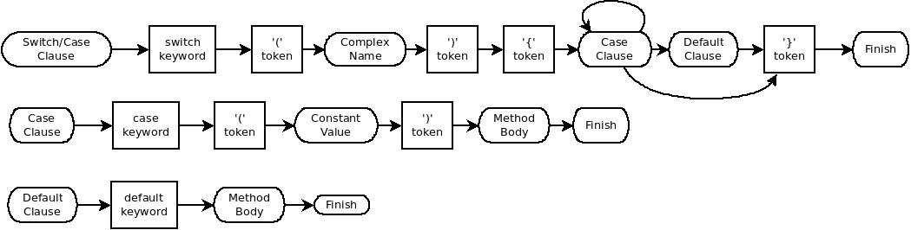


## Constructors and Destructors

Constructors and destructors, as one would expect, are called automatically when a class is created or destroyed.  There is a default constructor and destructor that is always implemented for a class and these are always called when a class is created or destroyed. There is no need to declare the default methods, but they may be declared for clarity. if desired.

### Constructor

The default constructor accepts no parameters and it is always called before any user-defined constructor in the same context. The default constructor creates any inherited classes and applies default values to any class attributes. For example, strings are initialized to zero length and ints are given a value of zero. If a different value is desired, then a constructor with no parameters can be declared and implemented. This is treated the same as any other override constructor. As with regular methods, the constructor may be overloaded by parameter types. Overloaded constructors must be declared in the class declaration. These constructors must be called explicitly but providing parameters to the creation call to the class. For example:

```
import imp1;

class class1(imp1.clas0) {
  public int var1;
  constructor(int);
}

class1.constructor(var) {
    var1 = var;
    imp1.clas0.constructor(123, "a string");
}

class class2 {
  public int meth();
}

class2.meth() {
    class1 cls = class1(0x123);
    return(0);
}
```

In the above example, the default constructor for ```class1``` is called, which sets ```var1``` to zero, then the override is called, which sets ```var1``` to ```0x123``` after casting it to an ```int```.  When an override constructor is declared, but not implemented, a syntax error is generated.

### Destructor

The default destructor is normally all that is required, since the garbage collector should destroy any unreachable memory. However, a destructor may be declared and implemented. This destructor will be called instead of the default constructor. If there is a declaration for a destructor but there is no implementation, then a warning is issued and the default destructor is used. Destructors accept no parameters and return no value, so they may not be overridden. Multiple declarations, or implementations, or destructors with return type or parameters are a syntax error.  Destructor declaration is optional and ignored.

## Exception Handling

Exceptions are simplified and only allow for a string to be sent to a single handler. The ```raise``` keyword accepts a single parameter of a formatted string. This is aimed at reporting errors more than actually trying to fix them. So exceptions in **ATlang** are an error handling mechanism and not a flow control mechanism.  All of the usual signals in a UNIX-like environment are handled as exceptions and a reasonable string string is generated for them. For things like errors when opening files, the runtime code generates an exception and an appropriate string and raises the exception.

Example:

```
class cls1 {
    int x; // private
    int y; // private
    public int meth1();
    public void meth2();
}

cls1.meth1() {
    if(x nequ y) {
        raise("x and y are not equal");
    }
    else {
        raise("x and y are equal");
    }
    return(x+y);
}

cls.meth2() {
    try {
        x = 1;
        y = 0;
        meth1();
    }
    except(m) {
        // prints "x and y are not equal"
        print(m);
    }
}
```

## Map, Dict, and List

These data structures are pseudo-classes. They cannot be inherited, but they do have methods that can be called on them. These methods are **TBD**.

## More information

See the tests directory for example syntax.
